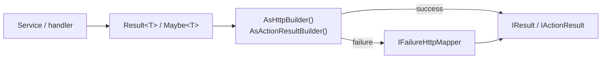

import Tabs from '@theme/Tabs';
import TabItem from '@theme/TabItem';

# ASP.NET Core Integration

`UnambitiousFx.Functional.AspNetCore` (v2.0.0) turns the functional types from `UnambitiousFx.Functional` into HTTP responses. Keep your domain and application services returning `Result`, `Result<T>`, and `Maybe<T>`, then adapt the outcome to HTTP at the API boundary — for both **Minimal APIs** (`IResult`) and **MVC controllers** (`IActionResult`).

The conversion is driven by fluent builders. A single failure-to-status mapper (`IFailureHttpMapper`) centralizes how each failure type becomes an HTTP status code and body, so transport concerns stay out of your business logic.

## Install

<Tabs>
  <TabItem value="cli" label=".NET CLI" default>
    ```bash
    dotnet add package UnambitiousFx.Functional.AspNetCore
    ```
  </TabItem>
  <TabItem value="packageref" label="PackageReference">
    ```xml
    <PackageReference Include="UnambitiousFx.Functional.AspNetCore" Version="2.0.0" />
    ```
  </TabItem>
</Tabs>

## How it works



- **Success** branches are mapped to a status code (200/201/202/204) with the value serialized as the body.
- **Failure** branches are passed to the configured `IFailureHttpMapper`, which produces a status code and (by default) an RFC `ProblemDetails` body.

## Registration (optional)

The builders work with no setup at all — they fall back to `DefaultFailureHttpMapper` when you don't pass a mapper. To register a shared mapper (and custom mappings) in DI, call `AddResultHttp`:

```csharp
using UnambitiousFx.Functional.AspNetCore;

builder.Services.AddResultHttp();
```

`AddResultHttp` registers the resolved `IFailureHttpMapper` and a `ResultHttpAdapterPolicy` as singletons. Pass a configuration delegate to add custom mappings — see [Custom Mappers](./custom-mappers). Inject the mapper into endpoints/controllers and pass it to the builder when you want DI-managed behavior:

```csharp
app.MapGet("/users/{id:guid}", async (
    Guid id,
    IUserService service,
    IFailureHttpMapper mapper) =>
    await service.GetUserAsync(id).AsHttpBuilder(mapper));
```

## Minimal API — quick look

Namespace: `UnambitiousFx.Functional.AspNetCore.Http`

```csharp
using UnambitiousFx.Functional.AspNetCore.Http;

// Result<T> → 200 OK with the value, failures mapped automatically
app.MapGet("/users/{id:guid}", async (Guid id, IUserService service) =>
    await service.GetUserAsync(id).AsHttpBuilder());

// Maybe<T> → 200 on Some, 404 on None
app.MapGet("/profiles/{id:guid}", async (Guid id, IProfileService service) =>
    await service.FindProfileAsync(id).AsHttpBuilder());

// 201 Created with a Location header
app.MapPost("/users", async (CreateUserRequest request, IUserService service) =>
    await service.CreateAsync(request)
                 .AsHttpBuilder()
                 .AsCreated(user => $"/users/{user.Id}"));
```

The builder is awaitable directly — `await someResult.AsHttpBuilder()` yields the `IResult`.

## MVC — quick look

Namespace: `UnambitiousFx.Functional.AspNetCore.Mvc`

```csharp
using UnambitiousFx.Functional.AspNetCore.Mvc;

[ApiController]
[Route("api/users")]
public sealed class UsersController : ControllerBase
{
    [HttpGet("{id:guid}")]
    public async Task<IActionResult> Get(Guid id, [FromServices] IUserService service)
        => await service.GetUserAsync(id).AsActionResultBuilder();
}
```

## Default failure mapping

`DefaultFailureHttpMapper` maps the standard failure types from `UnambitiousFx.Functional.Failures`:

| Failure type             | HTTP status              | Body            |
| ------------------------ | ------------------------ | --------------- |
| `ValidationFailure`      | 400 Bad Request          | `ProblemDetails`|
| `BadRequestFailure`      | 400 Bad Request          | `ProblemDetails`|
| `NotFoundFailure`        | 404 Not Found            | `ProblemDetails`|
| `UnauthorizedFailure`    | 401 Unauthorized         | `ProblemDetails`|
| `UnauthenticatedFailure` | 403 Forbidden            | `ProblemDetails`|
| `ConflictFailure`        | 409 Conflict             | `ProblemDetails`|
| `ExceptionalFailure`     | 500 Internal Server Error| `ProblemDetails`|
| Any other failure        | 500 Internal Server Error| `ProblemDetails`|

:::note Naming vs. status
The default mapper maps `UnauthorizedFailure` to **401** and `UnauthenticatedFailure` to **403**. If your API contract expects the conventional 401/403 split, override these with a [custom mapper](./custom-mappers).
:::

## Learn more

- [HTTP Mapping (Minimal API)](./http-mapping) — the full builder API, status-code control, headers, Problem Details shape, and Minimal API patterns.
- [MVC Patterns](./mvc-patterns) — controller usage and `IActionResult` builders.
- [Custom Mappers](./custom-mappers) — customize failure-to-status mapping and adapter policy.

## See also

- [Result](/docs/result/)
- [Maybe](/docs/maybe/)
- [Failures and Metadata](/docs/failures-and-metadata)
