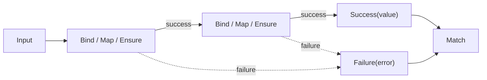

import Tabs from '@theme/Tabs';
import TabItem from '@theme/TabItem';

# Functional

UnambitiousFx.Functional is a lightweight, performance-focused functional programming library for .NET. It makes failure handling and optional values elegant and type-safe through railway-oriented programming, so errors become part of your type signatures instead of control-flow exceptions.

## Key features

- **`Result` / `Result<T>`** — railway-oriented programming for failure handling without exceptions.
- **`Maybe<T>`** — type-safe optional values, no more null reference exceptions.
- **Rich failure types** — `ValidationFailure`, `NotFoundFailure`, `ConflictFailure`, `UnauthorizedFailure`, and more, each with a machine-readable `Code`.
- **Metadata** — attach contextual key/value information to any result.
- **Async first** — full support for `Task<T>` and `ValueTask<T>` across every operator.
- **ASP.NET Core integration** — convert results to HTTP responses with sensible status-code mapping.
- **xUnit assertions** — fluent `ShouldBe()` assertions for functional types.
- **Zero-allocation & AOT** — `readonly struct` value types, minimal heap pressure, NativeAOT-friendly.

## Railway-oriented flow

A pipeline forms a "track": success values flow down the happy path through `Bind`/`Map`, while the first failure short-circuits everything that follows.



## Packages

<Tabs>
  <TabItem value="cli" label=".NET CLI" default>
    ```bash
    dotnet add package UnambitiousFx.Functional
    dotnet add package UnambitiousFx.Functional.AspNetCore   # optional — web API integration
    dotnet add package UnambitiousFx.Functional.xunit        # optional — test assertions
    ```
  </TabItem>
  <TabItem value="packageref" label="PackageReference">
    ```xml
    <PackageReference Include="UnambitiousFx.Functional" Version="2.0.0" />
    <!-- optional -->
    <PackageReference Include="UnambitiousFx.Functional.AspNetCore" Version="2.0.0" />
    <PackageReference Include="UnambitiousFx.Functional.xunit" Version="2.0.0" />
    ```
  </TabItem>
</Tabs>

| Package                              | Purpose                                                          |
| ------------------------------------ | --------------------------------------------------------------- |
| `UnambitiousFx.Functional`           | Core types: `Result`, `Result<T>`, `Maybe<T>`, failures, metadata. |
| `UnambitiousFx.Functional.AspNetCore`| Map results to `IActionResult` / `IResult` HTTP responses.      |
| `UnambitiousFx.Functional.xunit`     | Fluent `ShouldBe()` assertions for functional types in tests.   |

Supported target frameworks: `net8.0`, `net9.0`, `net10.0`. The core package has no runtime dependencies.

## Quick start

```csharp
using UnambitiousFx.Functional;
using UnambitiousFx.Functional.Failures;

static Result<int> ParsePositive(string input)
{
    if (!int.TryParse(input, out var value))
        return Result.Failure<int>(new ValidationFailure("Input is not a valid integer"));

    return value > 0
        ? Result.Success(value)
        : Result.Failure<int>(new ValidationFailure("Value must be positive"));
}

var result = ParsePositive("42")
    .Map(value => value * 2)                                             // transform the success value
    .Ensure(value => value < 1000, new ValidationFailure("Too large"))  // add a guard
    .Bind(value => Result.Success(value.ToString()));                   // chain another Result

result.Match(
    success: text  => Console.WriteLine($"Success: {text}"),
    failure: error => Console.WriteLine($"Failure: {error.Code} - {error.Message}"));
```

## Design principles

- **Errors are values** — failures are part of the type signature, not exceptions used for control flow.
- **Zero-allocation** — core types are `readonly struct`s that minimize heap pressure on the success path.
- **Composition over exceptions** — chain operations with `Bind`, `Map`, `Ensure`, `Recover`, and `Tap`.
- **Modern C#** — file-scoped namespaces, records, pattern matching, and extension members throughout.

## Next steps

Follow this path from fundamentals to advanced integration:

1. [Getting Started](./getting-started) — install, create your first `Result`, and chain operations.
2. [Result](./result/) — the full railway-oriented API surface.
3. [Maybe](./maybe/) — optional values without null.
4. [Failures and Metadata](./failures-and-metadata) — error modeling, failure codes, and contextual data.
5. [ASP.NET Core](./aspnetcore/) — convert results to HTTP responses.
6. [xUnit](./xunit/) — fluent assertions for functional types in tests.
